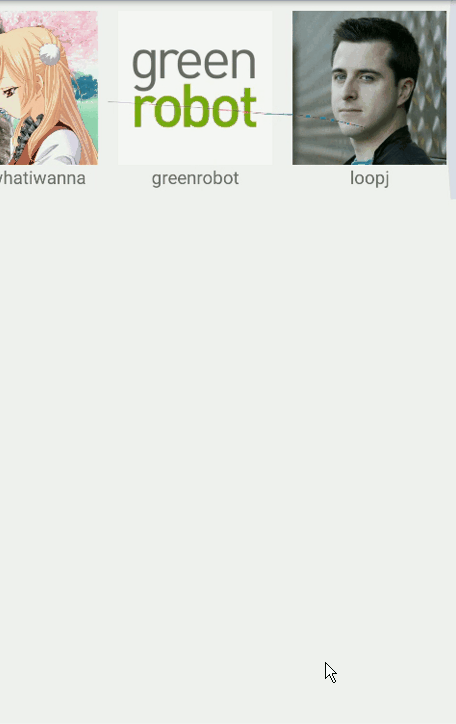

# Kotlin + MVP + Retrofit2 + RxJava2 + Daggers Demo.

## 效果

* try
[Donwload APK](https://github.com/halohoop/Kotlin_Mvp_R2R2D2/releases/download/v1.0/app-release_v1.0.apk)

## 概述

* **Demo的功能是显示，自己的Github 和 大神的Github 之间相差多少个Followers.**
* 三个接口:
	* 1.~~https://api.github.com/search/users?q={id}~~
	* 2.[http://halohoop.com/halohoop_custom_datas/meals-kotlin_mvp_retrofit2_rxjava2_dagger2_demo/user1.json](http://halohoop.com/halohoop_custom_datas/meals-kotlin_mvp_retrofit2_rxjava2_dagger2_demo/user1.json)
	* 3.https://api.github.com/users/{id}

* 使用Retrofit2请求上述api；
* 使用Dagger2注入对象；
* 整体架构使用MVP；
* P层使用RxJava2辅助过度连接M层和V层；

## Use Android Studio Version
* 3.0 Canary 4

## Thanks for

* [https://github.com/grantland/android-autofittextview](https://github.com/grantland/android-autofittextview)
* [https://github.com/robinhood/ticker](https://github.com/robinhood/ticker)

## More Detail

* See [http://halohoop.com/2017/06/27/meals-kotlin_mvp_retrofit2_rxjava2_dagger2_demo/](http://halohoop.com/2017/06/27/meals-kotlin_mvp_retrofit2_rxjava2_dagger2_demo/)

## License

    Copyright 2017, Halohoop

    Licensed under the Apache License, Version 2.0 (the "License");
    you may not use this file except in compliance with the License.
    You may obtain a copy of the License at

       http://www.apache.org/licenses/LICENSE-2.0

    Unless required by applicable law or agreed to in writing, software
    distributed under the License is distributed on an "AS IS" BASIS,
    WITHOUT WARRANTIES OR CONDITIONS OF ANY KIND, either express or implied.
    See the License for the specific language governing permissions and
    limitations under the License.